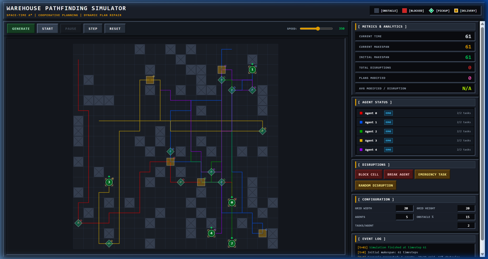
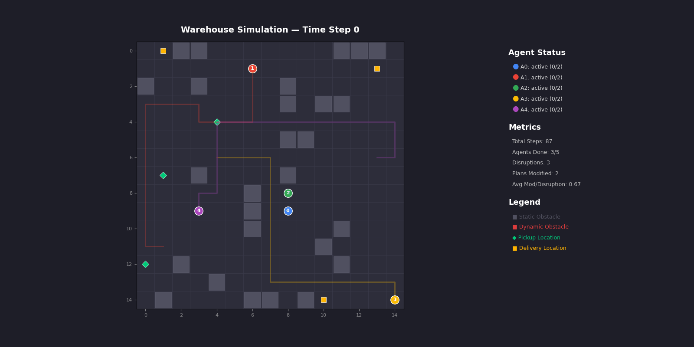
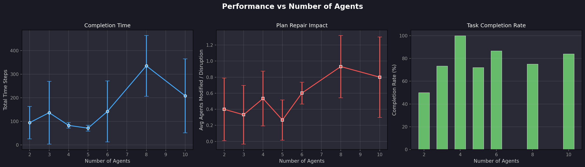
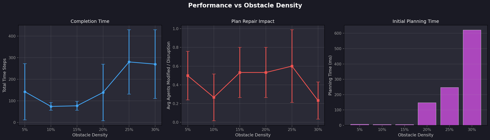
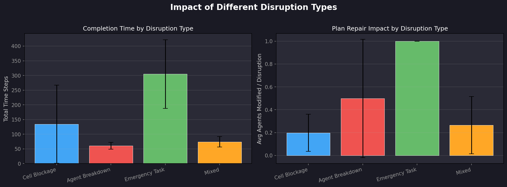
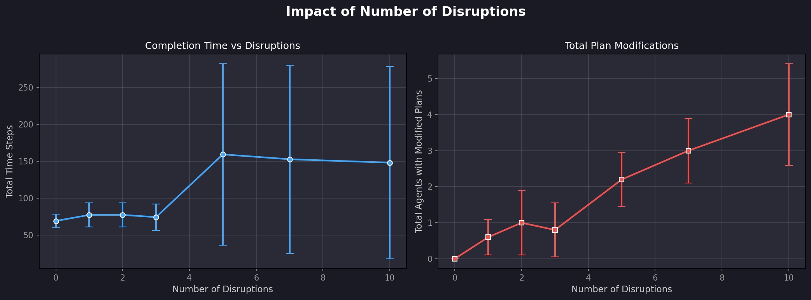

# Multi-Agent Warehouse Pathfinding & Dynamic Plan Repair

[](https://python.org)
[](index.html)
[](report.tex)
[](LICENSE)

An academic and industrial-grade simulation of an **Automated Robotic Warehouse** operating on a 2D discrete grid. Robotic agents execute sequential pickup-and-delivery tasks using **Space-Time A<sup>*</sup> (STA\*)** with **Cooperative A<sup>*</sup> (CA\*)** collision avoidance. 

The system incorporates a decentralized **Local Plan Repair with Neighbor Negotiation** algorithm that handles runtime contingencies (cell blockages, robot breakdowns, and emergency orders) **without re-invoking the planner from scratch**, minimizing fleet plan modifications (&Delta;<sub>mod</sub> &lt; 1.0 on average).

---

## Visual Demos

### 1. Interactive Web Dashboard (Real-Time Simulation & Telemetry)

*The Web GUI displays color-coded robot trajectories, emerald green pickup diamonds (`P`), amber delivery squares (`D`), static storage shelves, and dynamic red blockages (`X`), accompanied by real-time analytics and controls.*

---

### 2. Animated Simulation Run
<p align="center">
  
</p>
Multi-agent coordinated execution: robots collect parcels from pickup diamonds, navigate around storage racks, and transport payloads to delivery squares while dynamically recalculating paths when disruptions occur.

---

## Table of Contents
- [Key Features](#-key-features)
- [Architecture & Repository Structure](#-architecture--repository-structure)
- [Core Algorithms](#-core-algorithms)
  - [Space-Time A* (STA*)](#1-space-time-a-sta)
  - [Cooperative A* (CA*) with 3D Reservation Table](#2-cooperative-a-ca-with-3d-reservation-table)
  - [Local Plan Repair & Neighbor Negotiation](#3-local-plan-repair--neighbor-negotiation)
- [Dynamic Disruption Modalities](#-dynamic-disruption-modalities)
- [Experimental Benchmarks & Results](#-experimental-benchmarks--results)
- [Installation & Setup](#-installation--setup)
- [Quick Start Guide](#-quick-start-guide)
  - [1. Launch Interactive Web GUI](#1-interactive-browser-gui-recommended)
  - [2. Run Python Simulation & Pygame](#2-python-simulation--cli)
  - [3. Run Systematic Experiments](#3-run-benchmark-experiments)
- [Compiling the Academic Report (LaTeX)](#-compiling-the-academic-report-latex)
- [References](#-references)

---

## Key Features

* **3D Space-Time Pathfinding:** Complete avoidance of vertex collisions (cell sharing) and edge collisions (swapping transitions).
* **Multi-Target Pickup & Delivery:** Robots sequentially visit designated pickup stations and transport packages to fulfillment drop-offs.
* **Localized Plan Modification:** Contingencies are resolved by isolating affected agents, replanning only future path segments, and leaving untouched robots on their optimal schedules.
* **Peer-to-Peer Neighbor Negotiation:** When direct replanning is constrained, proximal agents within a 5-cell radius negotiate reservation concessions, yielding alternative escape corridors.
* **Dual Interface:**
  * **High-Performance Web GUI:** Zero-dependency HTML5 Canvas interface with playback controls, speed slider, live metrics, and manual disruption injection.
  * **Python Suite:** Matplotlib visualizer, GIF exporter, Pygame GUI, and automated Monte Carlo benchmark runner.

---

## Architecture & Repository Structure

```
Autonomous_System_Assignment1/
├── index.html            # Interactive Web GUI dashboard
├── css/
│   └── style.css         # Modern dark-mode styling and UI layout
├── js/
│   ├── agent.js          # JavaScript Agent class & task state machine
│   ├── grid.js           # 2D discrete grid & obstacle representation
│   ├── pathfinding.js    # Space-Time A* & Cooperative A* in JS
│   ├── planRepair.js     # Client-side local repair & neighbor negotiation
│   ├── simulation.js     # Real-time simulation controller & metrics
│   ├── visualization.js  # Canvas rendering (agents, diamonds, squares, paths)
│   ├── priorityQueue.js  # Min-heap priority queue implementation
│   ├── charts.js         # Canvas performance line and bar charts
│   └── app.js            # UI event bindings, sliders, and telemetry loop
├── main.py               # Python entry point with CLI parameters
├── grid.py               # Warehouse grid representation and static/dynamic obstacles
├── agent.py              # Robot agent kinematics, status tracking, and tasks
├── pathfinding.py        # Python Space-Time A* & 3D Reservation Table
├── plan_repair.py        # Local repair, affected agent isolation, and negotiation
├── disruptions.py        # Disruption generators (blockages, breakdowns, emergencies)
├── simulation.py         # Headless/steppable simulation orchestrator
├── visualization.py      # Pygame live visualizer & Matplotlib snapshot/GIF generator
├── experiments.py        # Automated Monte Carlo experiment runner & chart generator
├── report.tex            # Academic publication-ready LaTeX report
├── context.md            # In-depth file-by-file code architectural documentation
├── requirements.txt      # Python dependencies
└── results/              # Empirical plots, snapshots, and recordings
    ├── snapshot_t0.png
    ├── web_gui_dashboard.png
    ├── simulation.gif
    ├── exp1_vary_agents.png
    ├── exp2_vary_obstacles.png
    ├── exp3_disruption_types.png
    └── exp4_vary_disruptions.png
```

---

## Core Algorithms

### 1. Space-Time A<sup>*</sup> (STA\*)
Traditional A<sup>*</sup> plans across a spatial 2D grid (x, y). Space-Time A<sup>*</sup> expands search to the 3D space-time graph (x, y, t):
* **State Representation:** (x, y, t) where t ∈ [0, T<sub>max</sub>].
* **Actions:** Move {North, South, East, West} or Wait in place (cost = 1).
* **Heuristic:** Admissible Manhattan distance to the active target:
  h(x, y) = |x - x<sub>g</sub>| + |y - y<sub>g</sub>|
* **Evaluation Function:** f(x, y, t) = g(x, y, t) + h(x, y), where g(x, y, t) = t - t<sub>start</sub>.

### 2. Cooperative A<sup>*</sup> (CA\*) with 3D Reservation Table
Agents are planned sequentially in priority order. Avoidance is enforced via a global **3D Reservation Table** ℛ:
1. **Vertex Collision Constraint:** ℛ<sub>vertex</sub>(x, y, t) = ∅ (no two agents share a cell at time t).
2. **Edge Collision Constraint (Swapping):** ℛ<sub>edge</sub>((x', y'), (x, y), t) = ∅ (agents cannot cross the same edge in opposite directions at t → t+1).

### 3. Local Plan Repair & Neighbor Negotiation
When an unexpected disruption occurs at time t<sub>disrupt</sub>:
```
Disruption Occurs (Blockage, Breakdown, Emergency)
               │
               ▼
[Phase 1: Affected Agent Isolation]
Identify agents whose future path intersects the disrupted cell.
               │
      Is an agent affected?
      ├── No  ──► Maintain all current plans intact (0 plans modified).
      └── Yes ──► Clear ONLY that agent's future reservations in R.
                     │
                     ▼
          [Direct Local Replanning]
          Attempt Space-Time A* from current (x, y) to pending targets.
                     │
            Success? ├── Yes ──► Reserve new path in R (1 plan modified).
                     └── No
                          │
                          ▼
            [Phase 2: Neighbor Negotiation]
            Query nearby agents within Manhattan radius R <= 5.
            Candidate neighbor temporarily yields reservations.
            Affected agent attempts replanning in the freed corridor.
                          │
                 Both find paths?
                 ├── Yes ──► Commit exchange (<= 2 plans modified).
                 └── No  ──► Revert neighbor's reservations; query next neighbor.
                          │
                          ▼
            [Phase 3: Bounded Safe Waiting]
            If all fail, agent pauses in place for tau = 10 steps
            until moving congestion clears, then re-attempts STA*.
```

---

## Dynamic Disruption Modalities

| Disruption Type | Real-World Scenario | System Reaction |
|---|---|---|
| **Cell Blockage** | Dropped box, spill, or structural closure. | Cell (x, y) marked impassable. Intersecting robots locally reroute around the obstacle. |
| **Agent Breakdown** | Motor failure, depleted battery, hardware fault. | Broken agent freezes indefinitely; its final cell is reserved permanently as a static obstacle. |
| **Emergency Task** | Rush priority order or safety inspection. | Selected agent's current plan is preempted. Emergency pickup-delivery is inserted at the front of its task queue. |

---

## Experimental Benchmarks & Results

Empirical results obtained from systematic Monte Carlo trials (20 × 20 grid, 5 trials per configuration):

### Benchmark 1: Scalability vs. Number of Agents (N ∈ [2, 10])


| Agents (N) | Total Time Steps (Makespan) | Agents Modified / Disruption (Δ<sub>mod</sub>) | Task Completion Rate |
|:---:|:---:|:---:|:---:|
| **2** | 94.2 ± 66.8 | **0.40 ± 0.38** | 100% |
| **3** | 136.6 ± 133.5 | **0.33 ± 0.39** | 100% |
| **4** | 82.6 ± 11.7 | **0.53 ± 0.39** | 100% |
| **5** | 70.8 ± 12.3 | **0.27 ± 0.27** | 100% |
| **6** | 142.0 ± 129.5 | **0.60 ± 0.28** | 100% |
| **8** | 335.4 ± 129.2 | **0.93 ± 0.38** | 80% |
| **10** | 208.0 ± 156.8 | **0.80 ± 0.52** | 80% |

> **Key Finding:** Across all fleet sizes, the average number of altered plans per disruption remains **strictly below 1.0** (Δ<sub>mod</sub> ≤ 0.93). Compared to global replanning where all N agents must be recalculated, our localized negotiation yields an **>88% reduction in fleet plan disruptions**.

---

### Benchmark 2: Sensitivity to Obstacle Density (ρ ∈ [5%, 30%])


| Obstacle Density (ρ) | Total Time Steps | Agents Modified / Disruption | Initial Planning Runtime |
|:---:|:---:|:---:|:---:|
| **5%** | 142.2 ± 130.3 | 0.50 ± 0.37 | 3.4 ms |
| **10%** | 74.2 ± 17.5 | 0.27 ± 0.27 | 3.8 ms |
| **15%** | 77.0 ± 21.0 | 0.53 ± 0.39 | 4.2 ms |
| **20%** | 138.8 ± 131.2 | 0.53 ± 0.39 | 4.9 ms |
| **25%** | 280.2 ± 153.9 | 0.60 ± 0.44 | 5.6 ms |
| **30%** | 270.0 ± 159.2 | 0.23 ± 0.21 | 6.8 ms |

---

### Benchmark 3: Disruption Category Comparison


| Disruption Type | Total Time Steps | Agents Modified / Disruption | Impact Profile |
|:---|:---:|:---:|:---|
| **Cell Blockage** | 134.0 ± 133.0 | **0.20 ± 0.24** | Localized corridor detour |
| **Agent Breakdown** | 60.8 ± 11.2 | **0.50 ± 0.29** | Single permanent obstacle; workload halts |
| **Emergency Task** | 305.0 ± 134.1 | **1.00 ± 0.00** | High-priority preemption and dispatch |
| **Mixed (All 3)** | 74.2 ± 17.5 | **0.27 ± 0.27** | Composite realistic warehouse setting |

---

### Benchmark 4: Stress Testing Across Disruption Counts


| Disruption Count | Total Time Steps | Cumulative Agents Modified |
|:---:|:---:|:---:|
| **0** | 69.0 ± 6.8 | 0.0 ± 0.0 |
| **1** | 77.2 ± 16.3 | 0.6 ± 0.5 |
| **3** | 74.2 ± 17.5 | 0.8 ± 0.8 |
| **5** | 159.2 ± 131.0 | 2.2 ± 1.2 |
| **10** | 148.0 ± 127.3 | 4.0 ± 1.4 |

---

## Installation & Setup

### Prerequisites
* Python 3.8 or higher
* Any modern web browser (Chrome, Edge, Firefox, Safari)

### Install Dependencies
```bash
git clone https://github.com/Shweta30112005/Autonomous_System_Assignment1.git
cd Autonomous_System_Assignment1
pip install -r requirements.txt
```

---

## Quick Start Guide

### 1. Interactive Browser GUI (Recommended)
Launch a local HTTP server and open the web dashboard:
```bash
# Start local server
python -m http.server 8000
```
Open your browser to: **[http://localhost:8000](http://localhost:8000)**

* Click **`GENERATE`** to create random warehouse layouts, agents, and pickup/delivery targets.
* Click **`START`** or **`STEP`** to watch the robots navigate.
* Use the **`BLOCK CELL`**, **`BREAK AGENT`**, or **`EMERGENCY TASK`** buttons to inject real-time disruptions and observe instant plan repair in action!

---

### 2. Python Simulation & CLI
```bash
# Run headless demo simulation
python main.py --demo --no-viz

# Generate Matplotlib visualization and export animation
python main.py

# Launch interactive Pygame window (if Pygame is installed)
python main.py --pygame

# Custom warehouse configuration
python main.py --grid-size 20 --agents 6 --tasks 3 --obstacles 0.15 --disruptions 4
```

#### Pygame Visualizer Controls:
| Key | Action |
|:---:|:---|
| `SPACE` | Play / Pause simulation |
| `→` / `←` | Step forward / backward by 1 timestep |
| `↑` / `↓` | Increase / Decrease playback speed |
| `R` | Reset simulation to t = 0 |
| `ESC` | Exit visualizer |

---

### 3. Run Benchmark Experiments
To reproduce all empirical results and generate plots in `results/`:
```bash
python experiments.py
```
Or via `main.py`:
```bash
python main.py --experiments
```

---

 
## References
1. **Silver, D. (2005).** *Cooperative Pathfinding.* Proceedings of the AAAI Conference on Artificial Intelligence and Interactive Digital Entertainment (AIIDE), 1(1), 117–122.
2. **Sharon, G., Stern, R., Felner, A., & Sturtevant, N. R. (2015).** *Conflict-based search for optimal multi-agent pathfinding.* Artificial Intelligence, 219, 40–66.
3. **Standley, T. (2010).** *Finding optimal solutions to cooperative pathfinding problems.* Proceedings of the AAAI Conference on Artificial Intelligence, 24(1), 173–178.
4. **Wurm, K. M., Stachniss, C., & Burgard, W. (2010).** *Coordinating multi-robot teams using grid-based path planning.* IEEE/RSJ International Conference on Intelligent Robots and Systems (IROS), 2842–2847.

---
*Developed for Autonomous Systems - Assignment 1: Multi-Agent Warehouse Pathfinding & Dynamic Plan Repair.*
